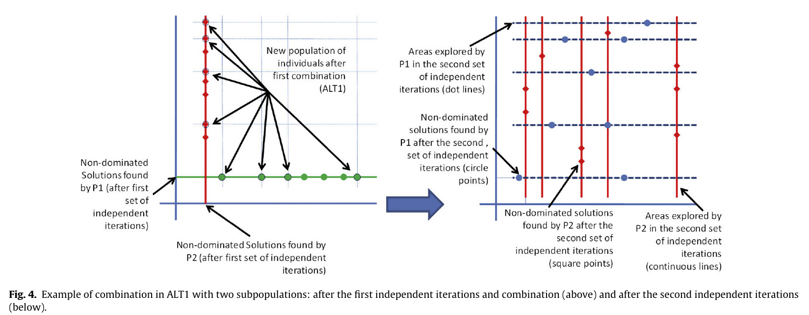

# Introducción

## Motivación

Alto número de características: microarrays, secuencias, EEG

. . . 

Maldición de la dimensionalidad: características > instancias

. . .

Previamente se ha considerado selección de características paralela o multiobjetivo pero no simultáneamente

## Comentario

La maldición de la dimensionalidad es un fenómeno más amplio:

- al aumentar la dimensionalidad las **distancias** entre ejemplos tienden a ser **similares**
- al aumentar la dimensionalidad el vecino **más cercano y el más lejano** tienden a estar a la **misma distancia**

Un algoritmo de selección evolutivo paralelo es de gran aplicabilidad, ¿plantear una experimentación con datasets de distintas fuentes?

# Optimización multi-objetivo

## Optimización multi-objetivo en selección de características no supervisada

Definición del problema: búsqueda de un vector de variables que verifique un conjunto de restricciones y **optimice un vector de funciones** (en el sentido de Pareto).

En aprendizaje no supervisado, considerar **sesgo de las medidas** hacia soluciones de menor dimensionalidad.

# Evolutivos

## Algoritmos evolutivos multi-objetivo paralelos

Descomposiciones para paralelización: funcional y **de datos**. Buscamos técnicas que provean speedups superiores aunque alteren el comportamiento del algoritmo.

\scriptsize

. . .

| Descomposiciones de datos            | altera | comunicación   | arquitecturas                    |
|--------------------------------------|--------|----------------|----------------------------------|
| computación distribuida de _fitness_ | **no** | frecuente      | maestro-réplica                  |
| uso de subpoblaciones                | sí     | **esporádica** | maestro-réplica, islas, difusión |

\normalsize

. . .

Reparto de los individuos en subpoblaciones: misma zona del frente de Pareto, o misma zona del espacio de búsqueda.

# Selección

## Selección de características no supervisada multi-objetivo paralela

Espacio de búsqueda con $e$ grupos cada uno con $f$ características:
$$\mathcal D = \{ \alpha:\{1,\dots,e\}\times\{1,\dots,f\}\rightarrow\{0,1\} \}$$

. . .

Idea: repartir en subpoblaciones, donde los individuos recorren los valores de un grupo y **dejan constantes el resto**.

. . .

Las estrategias se diferencian en la etapa de **combinación de subpoblaciones**.

. . .

Supongamos $p$ subpoblaciones cada una con $r$ individuos.

## Selección de características no supervisada multi-objetivo paralela

## Alternativa 1

Los individuos de una subpoblación pueden tener **distintos valores en las componentes constantes**.

*Combine & Distribute*: se escoge una nueva población base de $r$ individuos preferentemente no dominados y se toma como base de las $p$ subpoblaciones. 

## Alternativa 2

Todos los individuos de una subpoblación tienen los **mismos valores en las componentes constantes**.

*Combine & Distribute*: se seleccionan $pr$ individuos no dominados y se envían a cada subpoblación, que los evalúan y eligen sus próximos $r$ individuos que comparten las componentes constantes.

## Alternativa 3

Todos los individuos de una subpoblación tienen inicialmente los **mismos valores en las componentes constantes**.

*Combine & Distribute*: la nueva $j$-ésima subpoblación se genera escogiendo $r-q$ individuos no dominados de la misma y añadiéndole $q$ soluciones no dominadas del resto.

## Comentario

¿Figuras contraintuitivas?

\scriptsize

"An example about the evolution of the explored search space in the case of two subpopulations with individuals $\alpha=(\alpha(1,1),\dots,\alpha(1,f),\alpha(2,1),\dots,\alpha(2,f))$ is provided in Fig. 4. In this figure, **the two dimensions correspond to the values of $\alpha(1,\cdot)$ and $\alpha(2,\cdot)$**, respectively, and the initial sets of populations are $(\alpha_i(1,\cdot),k_2)$ and $(k_1,\alpha_j(2,\cdot))$ with $i,j=1,\dots,r$."

\normalsize

# Experimentación

## Resultados experimentales

Setup:

- AE base: NSGA-II
- Clasificador: SOM
- Objetivos: mínimas distancias entre vectores cercanos y máximas entre lejanos
- Benchmarks: 6 datasets de EEG, más características que ejemplos

## Resultados experimentales

1. Comparación con otros selectores de tipo wrapper
    - La propuesta es competitiva
2. Comparación de las 4 variantes con la versión secuencial
    - La mayoría de diferencias no son significativas
2. Comparación de las 4 variantes paralelizadas + (2, 4, 6, 8) procesadores
    - Mejoras superlineales en Alt2 y 3
3. Estimación de parámetros de los modelos de speedup
    \includegraphics[width=0.5\textwidth]{speedup.png}

## Comentario

Experimentación muy completa en cuanto a perspectivas cubiertas (comparación con otras propuestas y con la versión secuencial, en rendimiento y en tiempo), es un buen apoyo de las propuestas realizadas.

# Conclusiones

## Conclusiones

**Novedad**: estrategias paralelas de resolución de problemas multi-objetivo, aplicadas a selección de características en EEG

**Resultados**: mejoran en ocasiones al algoritmo secuencial y las ganancias de velocidad son buenas, compromiso entre velocidad y calidad

**Trabajo futuro**: 

- más AEs multiobjetivo base
- arquitectura de islas
- efecto de los parámetros evolutivos en el rendimiento
- funciones objetivo en clustering no supervisado

## Comentario

Trabajo de **dificultad notable**: requiere del uso y dominio de conceptos variados (algoritmos evolutivos, paralelización, mapas autoorganizativos y selección de características). Resultados interesantes que abren las puertas a utilizar estas estrategias en **otras aplicaciones**.

Otra posible extensión: entrenamiento de técnicas de **extracción de características** mediante algoritmos evolutivos paralelizados, e.g. autoencoders mediante neuroevolución
